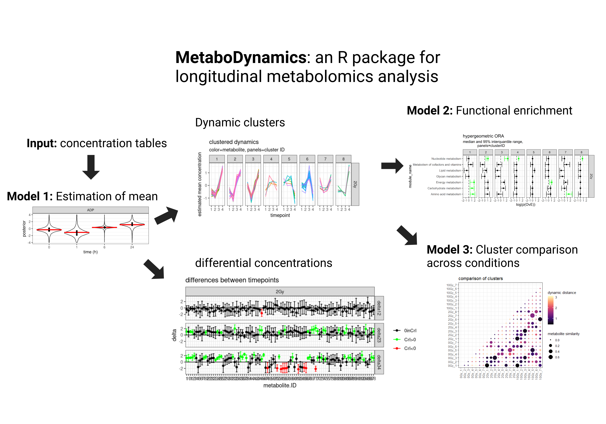

<!-- README.md is generated from README.Rmd. Please edit that file -->

```{r, include = FALSE}
knitr::opts_chunk$set(
  collapse = TRUE,
  comment = "#>",
  fig.path = "man/figures/README-",
  out.width = "100%"
)
```

# MetaboDynamics : developmental version

<!-- badges: start -->
<!-- badges: end -->

MetaboDynamics provides a framework of Bayesian models for robust and easy
analysis of longitudinal Metabolomics Data. It takes concentration tables and 
KEGG IDs of metabolites as input and provides robust estimation of mean 
concentrations, functional enrichment analysis employing the KEGG database and 
comparison of dynamic clusters of different biological conditions.

## Installation

You can install the development version of MetaboDynamics from [GitHub](https://github.com/) with:

``` r
# install.packages("devtools")
devtools::install_github("KatjaDanielzik/MetaboDynamics")
```

## Overview
MetaboDynamics facilitates the analysis of longitudinal metabolomics
data. Common tools mostly only allow the comparison between two timepoints or
experimental conditions and are using frequentist statistical methods. 

As metabolomics data is often noisy, robust methods for the estimation of 
dynamics are needed. 
MetaboDynamics allows longitudinal analysis over multiple timepoints and
experimental conditions employing 3 probabilistic models:

1) A hierachical Bayesian model allows the robust estimation of means at every
timepoint. Its outputs are A) differences between timepoint for every metabolite
B) metabolite specific dynamic profiles that can be used for clustering.

2) Over-representation analysis of KEGG-functional modules in dynamics clusters
with a quantitative model that employs a hypergeometric distribution and reports
probabilities of a functional module being over-represented in a cluster.

3) Estimation of the distance in regards to dynamics between clusters of different
experimental conditions with a Bayesian models that infers the mean pairwise
euclidean distance between two clusters. Combined with the comparison of metabolites
that compose two clusters it allows to spot differences and similarities between
experimental conditions. 


## Workflow

For a worked example see Vignette (Folder /vignettes, file MetaboDynamics.html).



