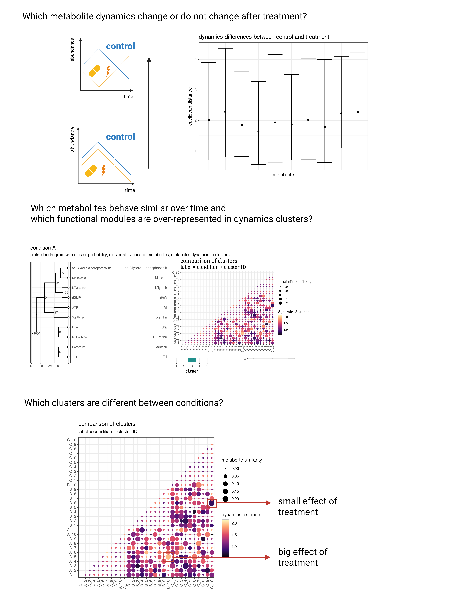

# MetaboDynamics:
[](https://lifecycle.r-lib.org/articles/stages.html#stable)
[](https://doi.org/10.18129/B9.bioc.MetaboDynamics )
[](https://cran.r-project.org/web/licenses/GPL)


# Data requirements
- MetaboDynamics requires at least triplicates of metabolite abundances for all
analyzed time points and conditions. No minimum number of metabolites is required.
- Data can be a data frame (see Vignette "using MetaboDynamics with data frames)
or a SummarizedExperiment object (demonstrated in this vignette).
- Metabolite abundances have to be stored in column named "metabolite", time points
in "time" and the experimental condition in "condition"
- For clustering of metabolite abundance dynamics are at least two time points required
- To conduct over-representation analysis on KEGG functional modules KEGG IDs of
metabolites are required
- To conduct comparison of metabolite abundance dynamics between clusters at least
two experimental conditions are required
- If an in vitro experiment is analyzed and cell counts should be incorporated in model, 
cell counts have to be estimated (i.e. cell counter not counting every cell) as a
poisson distribution is assumed. At least one replicate of cell counts per time
point and condition is required. 

Metabolite abundances have to be adequately normalized and scaled.
The expected scaling is explained in the following workflow. 

In the case of an in vitro experiment with available cell counts for all time points
and conditions no scaling or normalization is necessary as this will be handled
by the fit_dynamics_model() function (model="raw_plus_counts")

## Installation

MetaboDynamics is an [R](https://cran.r-project.org/) package available
from [Bioconductor](https://www.bioconductor.org).

URL: https://www.bioconductor.org/packages/release/bioc/html/MetaboDynamics.html 

To install MetaboDynamics, start R (4.5) and enter:

``` r
if (!require("BiocManager", quietly = TRUE))
    install.packages("BiocManager")

BiocManager::install("MetaboDynamics")
```
You can also install the development version (current bug fixes and added features
can be found in the [NEWS](https://github.com/KatjaDanielzik/MetaboDynamics/blob/main/inst/NEWS.md) 
file) of MetaboDynamics from
[GitHub](https://github.com/) with:

``` r
if (!require("devtools", quietly = TRUE))
    install.packages("devtools")

devtools::install_github("KatjaDanielzik/MetaboDynamics",build_vignettes=TRUE)
```

## Overview


MetaboDynamics facilitates the analysis of longitudinal metabolomics
data e.g. from untargeted LC-MS. Common tools mostly only allow the comparison
between two time points instead of analyzing the full observed dynamics profile
of metabolite concentrations over multiple time points. Furthermore common tools
mostly only allow to compare two experimental conditions at a single time point
and are using frequentist statistical methods. As metabolomics data is often noisy,
robust methods for the estimation of mean metabolite concentrations per time point
are needed. 

MetaboDynamics allows longitudinal analysis over
multiple time points and experimental conditions employing three
probabilistic models:

1)  A hierarchical Bayesian model for the robust estimation of means at
    every time point despite varying spread between time points. Hierarchical
    Bayesian models are known to balance between over- and underfitting, allowing
    to gain as much information from the noisy data as possible while not being overly
    confident about the estimates. Its outputs are A) differences between time 
    points for every metabolite (differential concentrations), B) estimated
    differences between metabolite abundance dynamics between different conditions,
    and C) metabolite specific dynamics profiles.
    
The Bayesian model returns posterior estimates (distributions of possible
values of the estimated parameters). It's output therefore can be used to
conduct clustering of metabolite abundance dynamics with bootstrapping (function
cluster_dynamics()), allowing to estimate the reliability of clusters of metabolite
abundance dynamics. 

2)  Over-representation analysis of KEGG-functional modules such as amino acid
    metabolism or KEGG pathways in dynamics clusters with a quantitative model 
    that employs a hypergeometric distribution and reports probabilities of a 
    functional module or pathway being over-represented in a cluster. Can also 
    estimate simultaneously under-representation of functional modules.

3)  Estimation of the dynamics similarity between metabolite clusters of 
    different experimental conditions with a Bayesian model. This model infers 
    the mean pairwise euclidean distance of composing metabolite dynamics between 
    two clusters (i.e. every metabolite dynamics from cluster A is compared with 
    every metabolite dynamics of cluster B). In combination with the comparison of 
    metabolites that compose two clusters this allows to spot differences and 
    similarities between experimental conditions. For examples clusters of 
    metabolites with similar metabolite composition but different dynamics 
    between experimental conditions.
    
With this framework the following questions can be answered:
    



## Workflow

For a worked example on a simulated data see [Vignette](https://www.bioconductor.org/packages/devel/bioc/vignettes/MetaboDynamics/inst/doc/MetaboDynamics.html) or if package is installed:

``` r
browseVignettes("MetaboDynamics")
```